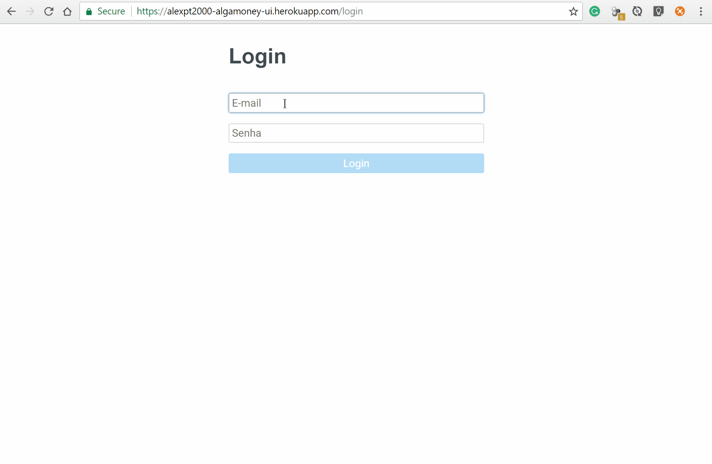
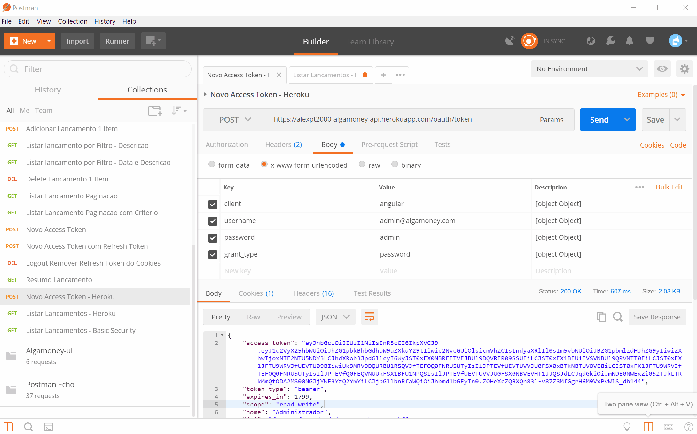
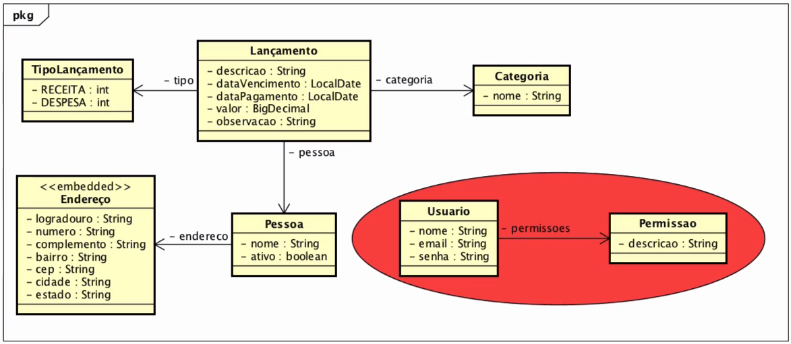

# Curso Algaworks
## Angular 4, REST e Spring Boot

## Deploy no Heroku

## UI - front-end
#### Endereco da aplicacao -  https://alexpt2000-algamoney-ui.herokuapp.com

## API - back-end
#### Endereco da API -  https://alexpt2000-algamoney-api.herokuapp.com

- Primeiro é requisitado um token atravez do Postman, fazendo um POST.
- Apos receber um token, o mesmo sera utilizado para as requisicoes GET dos demais pedidos na API.

## Diagrama da API

# Conteúdo do curso

## 1. Introdução ao REST
- 1.1. Introdução ao curso.mp4
- 1.2. Como usar o suporte.mp4
- 1.3. O que ‚ SOFEA.mp4
- 1.4. O que ‚ REST.mp4
- 1.5. Conhecendo o projeto do curso.mp
- 1.6. Ambiente de desenvolvimento REST
- 1.7. Testando APIs com Postman.mp4
- 1.8. Introdução ao protocolo HTTP.mp4

## 2. Fundamentos do REST
- 2.1. O que ‚ um recurso.mp4
- 2.2. Representaçäes de um recurso.mp4
- 2.3. Modelo de maturidade Richardson - N¡vel 0.mp4
- 2.4. Modelo de maturidade Richardson - N¡vel 1.mp4
- 2.5. Modelo de maturidade Richardson - N¡vel 2.mp4
- 2.6. Modelo de maturidade Richardson - N¡vel 3.mp4
- 2.7. HATEOAS.mp4
- 2.8. Segurança de APIs REST.mp4
- 2.9. Idempotˆncia.mp4                                         

## 3. Primeiras consultas e cadastros na API
- 3.1. Criando o projeto da API.mp4
- 3.2. Conectando ao MySQL.mp4
- 3.3. Migração de dados com Flyway.mp4
- 3.4. Consultando primeiro recurso com GET.mp4
- 3.5. Coleção vazia, o que retornar.mp4
- 3.6. Cadastrando nova categoria com POST.mp4
- 3.7. Desafio_ Retornar 404 caso não exista a categoria.mp4
- 3.8. Validando atributos desconhecidos.mp4
- 3.9. Tratando erros com ExceptionHandler.mp4                      
- 3.10. Validando valores invàlidos com Bean Validation.mp4
- 3.11. Desafio_ Criando o cadastro de pessoa.mp4
- 3.12. Usando eventos para adicionar header Location.mp4

## 4. Atualização e remoção de recursos na API
- 4.1. Removendo pessoa com DELETE.mp4
- 4.2. Sobre atualização de recursos REST.mp4
- 4.3. Atualizando pessoa com PUT.mp4
- 4.4. Implementando atualização parcial com PUT.mp4

## 5. Relacionamentos entre recursos REST
- 5.1. Criando a migração e entidade de lançamento.mp4
- 5.2. Desafio_Lista e busca de lançamentos.mp4
- 5.3. Desafio_Cadastrando o primeiro lançamento.mp4
- 5.4. Validando inconsistˆncias.mp4
- 5.5. Validando lançamento com Bean Validation.mp4
- 5.6. Regra para não salvar pessoa inativa.mp4
- 5.7. Implementando pesquisa de lançamento com Metamodel.mp4
- 5.8. Desafio_Removendo lançamentos.mp4
- 5.9. Implementando a paginação de lançamentos.mp4                 

## 6. Segurança da API
- 6.1. Implementando autenticação Basic.mp4
- 6.2. Fluxo bàsico do OAuth.mp4
-- https://www.digitalocean.com/community/tutorials/an-introduction-to-oauth-2
- 6.3. Implementando segurança com OAuth 2 e Password Flow.mp4
- 6.4. JSON Web Tokens - JWT.mp4
-- https://jwt.io/
- 6.5. Configurando JWT no projeto.mp4
- 6.6. Renovando o access token com o refresh token.mp4
- 6.7. Movendo o refresh token para o cookie.mp4
- 6.8. Movendo o refresh token do cookie para a requisição.mp4
- 6.9. O que ‚ CORS.mp4                                             
- 6.10. Criando filtro para CORS.mp4
- 6.11. Movendo o usuàrio para o banco de dados.mp4
- 6.12. Adicionando permissäes de acesso.mp4
- 6.13. Desafio_Finalizando permissäes de acesso.mp4
- 6.14. Implementando o logout.mp4

## 7. Deploy da API em produção
- 7.1. Implementando projeção de lançamento.mp4
- 7.2. Profiles do Spring.mp4
- 7.3. Criando a conta no Heroku.mp4
- 7.4. Deploy da API na nuvem.mp4
- 7.5. Nome do usuàrio no token JWT.mp4
- 7.6. Alternando OAuth 2 e Basic Security com profiles.mp4
- 7.7. Desafio_Pesquisa de pessoa.mp4
- 7.8. Ajustando o CEP.mp4
- 7.9. Desafio_Atualização de lançamento.mp4                      

## 8. Introdução ao Angular
- 8.1. O que ‚ Angular.mp4
- 8.2. AngularJS vs Angular 2 4 X a confusão das versäes.mp4
- 8.3. Instalando o Visual Studio Code.mp4
- 8.4. Introdução ao HTML.mp4
- 8.5. Introdução ao CSS.mp4
- 8.6. Instalando o Node.js e NPM.mp4
- 8.7. Instalando e criando um projeto com Angular CLI.mp4
- 8.8. Abrindo o projeto no VS Code.mp4
- 8.9. Abrindo e executando um exemplo do curso.mp4                 

## 9. Fundamentos do Angular, componentes e data binding
- 9.1. Bootstrapping e AppModule.mp4
- 9.2. O que são componentes.mp4
- 9.3. Criando um componente.mp4
- 9.4. Instalando a biblioteca CSS do Bootstrap.mp4
- 9.5. Introdução a data binding.mp4
- 9.6. Usando interpolação.mp4
- 9.7. Usando event binding.mp4
- 9.8. Usando variàvel de referˆncia.mp4
- 9.9. Usando property binding.mp4                                                   
- 9.10. Usando two-way data binding.mp4
- 9.11. Introdução …s diretivas.mp4
- 9.12. Exibindo condicionalmente com as diretivas ngIf e hidden.mp4
- 9.13. Iterando com a diretiva ngFor.mp4
- 9.14. Binding de propriedades customizadas com @Input.mp4
- 9.15. Binding de eventos customizados com @Output e EventEmitter.mp4
- 9.16. Adicionando estilos CSS em componentes.mp4
- 9.17. Estilos CSS dinƒmicos com ngStyle.mp4
- 9.18. Classes CSS dinƒmicas com ngClass.mp4

## 10. Páginas de pesquisa
- 10.1. Instalando plugins £teis no Visual Studio Code.mp4
- 10.2. Escolhendo uma biblioteca de componentes.mp4
- 10.3. Criando o projeto do curso e instalando o PrimeNG.mp4
- 10.4. Adicionando o formulàrio de pesquisa de lançamentos.mp4
- 10.5. Adicionando uma tabela de dados.mp4
- 10.6. Customizando colunas com ng-template.mp4
- 10.7. Fazendo paginação de dados.mp4
- 10.8. Adicionando tooltip.mp4
- 10.9. Colocando a tabela de dados responsiva.mp4                        
- 10.10. Criando o componente de pesquisa de lançamentos.mp4
- 10.11. Criando o componente de barra de navegação.mp4
- 10.12. Adicionando menu intercambiàvel.mp4
- 10.13. Desafio_ criando componente de pesquisa de pessoas.mp4

## 11. Diretivas e pipes
- 11.1. Criando diretivas customizadas.mp4
- 11.2. Respondendo a eventos do hospedeiro com @HostListener.mp4
- 11.3. Vinculando propriedades do hospedeiro com @HostBinding.mp4
- 11.4. Usando property binding em diretivas customizadas.mp4
- 11.5. Exportando a API da diretiva para o template.mp4
- 11.6. Conhecendo e usando pipes.mp4
- 11.7. Passando parƒmetros para pipes.mp4
- 11.8. Desafio_ usando pipes.mp4                                            

## 12. Formulários e validação
- 12.1. Introdução aos formulàrios.mp4
- 12.2. Template-driven Forms_ Criando um formulàrio.mp4
- 12.3. Registrando os controles do formulàrio.mp4
- 12.4. Adicionando opçäes dinƒmicas no campo de seleção.mp4
- 12.5. Definindo o valor padrão em campos com ngModel.mp4
- 12.6. Two-way binding com ngModel.mp4
- 12.7. Adicionando validação em formulàrios.mp4
- 12.8. Exibindo erro de validação do formulàrio.mp4
- 12.9. Exibindo erro de validação de controles do formulàrio.mp4              
- 12.10. Rastreando o estado em controles do formulàrio.mp4
- 12.11. Estilizando os campos invàlidos com classes CSS do Angular.mp4
- 12.12. Estilizando os campos invàlidos com Bootstrap.mp4
- 12.13. Limpando formulàrios (reset) .mp4

## 13. Páginas de cadastro
- 13.1. Criando o prot¢tipo do formulàrio de cadastro de lançamentos.mp4
- 13.2. Adicionando seletor de data (componente Calendar).mp4
- 13.3. Adicionando botão de seleção.mp4
- 13.4. Adicionando caixa de seleção (componente Dropdown).mp4
- 13.5. Adicionando màscara de dinheiro com ng2-mask-money.mp4
- 13.6. Desafio_ criando o prot¢tipo do formulàrio de cadastro de pessoa.mp4
- 13.7. Adicionando campo com màscara (componente InputMask).mp4
- 13.8. Validando controles de formulàrio com PrimeNG.mp4
- 13.9. Criando componente de mensagem de erro de validação.mp4                     
- 13.10. Desafio_ controles, validaçäes e mensagens de erro.mp4
- 13.11. Desafio_ criando mais componentes.mp4

## 14. Módulos do Angular
- 14.1. Introdução aos m¢dulos.mp4
- 14.2. Criando um m¢dulo e exportando um componente.mp4
- 14.3. Reexportando um m¢dulo.mp4
- 14.4. Criando um componente interno do m¢dulo.mp4
- 14.5. O que são Feature Modules.mp4
- 14.6. Criando um Feature Module.mp4
- 14.7. Desafio_ criando o feature module de pessoas.mp4
- 14.8. O que são Shared Modules.mp4
- 14.9. Criando um Shared Module.mp4                              
- 14.10. O que ‚ Core Module.mp4
- 14.11. Desafio_ criando o Core Module.mp4

## 15. Serviços e injeção de dependências
- 15.1. Introdução aos serviços.mp4
- 15.2. Implementando um serviço.mp4
- 15.3. O que ‚ injeção de dependˆncias.mp4
- 15.4. Configurando o injetor com provider por classe.mp4
- 15.5. Configurando o injetor com provider por fàbrica.mp4
- 15.6. Configurando o injetor com provider por valor e o decorator @Inject.mp4
- 15.7. Injetando serviços dentro de serviços e o decorador @Injectable.mp4
- 15.8. Como funciona o Injetor Hieràrquico.mp4                                         

## 16. Requisições HTTP
- 16.1. Por que precisamos de requisiçäes HTTP.mp4
- 16.2. Instalando e testando o json-server.mp4
- 16.3. Fazendo requisição com GET e recebendo o retorno.mp4
- 16.4. Fazendo requisição com POST.mp4
- 16.5. Fazendo requisição com DELETE.mp4
- 16.6. Fazendo requisição com PUT.mp4
- 16.7. Tratando erros de requisiçäes HTTP.mp4                         

## 17. Implementando os serviços do projeto
- 17.1. Revisando e iniciando o back-end do projeto do curso.mp4
- 17.2. Criando o serviço de consulta de lançamentos.mp4
- 17.3. Adicionando filtro por descrição na pesquisa de lançamentos.mp4
- 17.4. Adicionando filtro por datas na pesquisa de lançamentos.mp4
- 17.5. Implementando a paginação no serviço de lançamentos.mp4
- 17.6. Configurando a paginação lazy do PrimeNG.mp4
- 17.7. Desafio_ criando a consulta e listagem de pessoas.mp4
- 17.8. Excluindo lançamentos e o decorador @ViewChild.mp4
- 17.9. Adicionando mensagem de sucesso com Angular Toasty.mp4                        
- 17.10. Adicionando diàlogo de confirmação antes da exclusão.mp4
- 17.11. Alterando o locale da aplicação para pt-BR.mp4
- 17.12. Criando um serviço de tratamento de erros.mp4
- 17.13. Desafio_ implementando a exclusão de pessoas.mp4
- 17.14. Desafio_ mensagem de erro de usuàrio na exclusão de pessoa.mp4
- 17.15. Desafio_ implementando a mudança de status de pessoas.mp4
- 17.16. Desafio_ implementando o serviço de listagem de categorias.mp4
- 17.17. Listando as categorias cadastradas no dropdown.mp4
- 17.18. Desafio_ listando as pessoas cadastradas no dropdown.mp4
- 17.19. Criando classes de modelo e usando no cadastro de lançamentos.mp4
- 17.20. Implementando o serviço de cadastro de lançamentos.mp4
- 17.21. Desafio_ implementando o cadastro de pessoas.mp4

## 18. Roteamento e navegação
- 18.1. Introdução a rotas.mp4
- 18.2. Configurando rotas na aplicação.mp4
- 18.3. Navegando com Router Link.mp4
- 18.4. Estilizando links da rota ativa.mp4
- 18.5. Recebendo parƒmetros da rota.mp4
- 18.6. Desafio_ implementando os serviços de atualização e busca por c¢digo.mp4
- 18.7. Preenchendo os campos na edição de lançamentos.mp4
- 18.8. Salvando lançamentos editados.mp4
- 18.9. Implementando navegação imperativa.mp4     
- 18.10. Fazendo redirecionamento.mp4
- 18.11. Tratando rota não encontrada.mp4
- 18.12. Definindo o t¡tulo da pàgina dinamicamente.mp4
- 18.13. Refatorando as rotas para usar Routing Module.mp4
- 18.14. Criando um Routing Module para o m¢dulo de funcionalidade.mp4
- 18.15. Desafio_ roteamento e edição de pessoas.mp4

## 19. Segurança do front-end
- 19.1. Introdução … segurança do front-end.mp4
- 19.2. Revisando a segurança da API com OAuth 2 e JWT.mp4
- 19.3. Desafio_ m¢dulo de segurança e prot¢tipo da tela de login.mp4
- 19.4. Implementando o serviço de autenticação com OAuth 2.mp4
- 19.5. Decodificando o JWT e armazenando no Local Storage.mp4
- 19.6. Tratando casos de erros e sucesso de autenticação.mp4
- 19.7. Adicionando o Access Token nas chamadas HTTP.mp4
- 19.8. Exibindo o nome do usuàrio logado.mp4
- 19.9. Exibindo o menu do sistema conforme permissäes do usuàrio.mp4       
- 19.10. Obtendo um novo access token.mp4
- 19.11. Interceptando chamadas HTTP para tratar a expiração do access token.mp4
- 19.12. Protegendo componentes.mp4
- 19.13. Protegendo rotas com guarda de rotas (CanActivate).mp4
- 19.14. E se o Refresh Token expirar.mp4
- 19.15. Tratando acessos de usuàrios deslogados na AuthGuard.mp4
- 19.16. Implementando o logout.mp4

## 20. Deploy em produção do cliente Angular
- 20.1. Configurando a aplicação com environment do Angular CLI.mp4
- 20.2. Fazendo build para o ambiente de produção.mp4
- 20.3. Respondendo requisiçäes com Node.js e Express.mp4
- 20.4. Fazendo deploy em produção no Heroku.mp4
- 20.5. Conclusão.mp4                                                          

## Create the JAR file
- https://www.youtube.com/watch?v=qDTUYkaXAEc

# Author

### Alexander Souza
- G00317835@gmit.ie
- alexpt2000@gmail.com
- https://github.com/alexpt2000gmit
- https://github.com/alexpt2000
- www.linkedin.com/in/alexander-souza-3a841539/